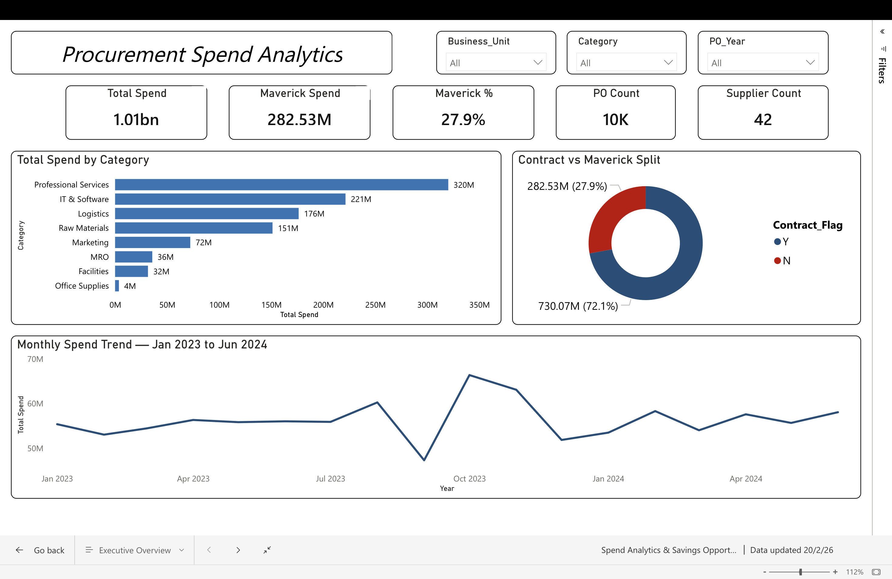
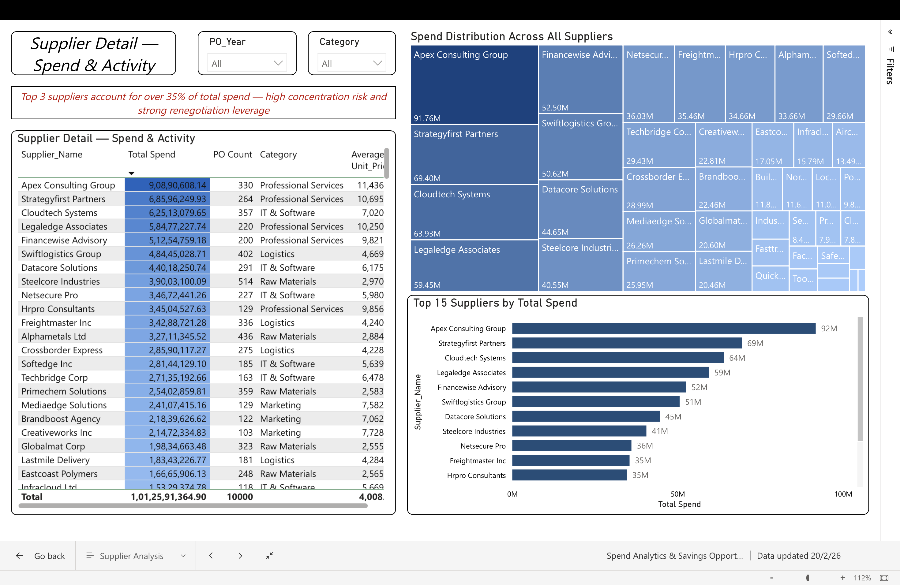
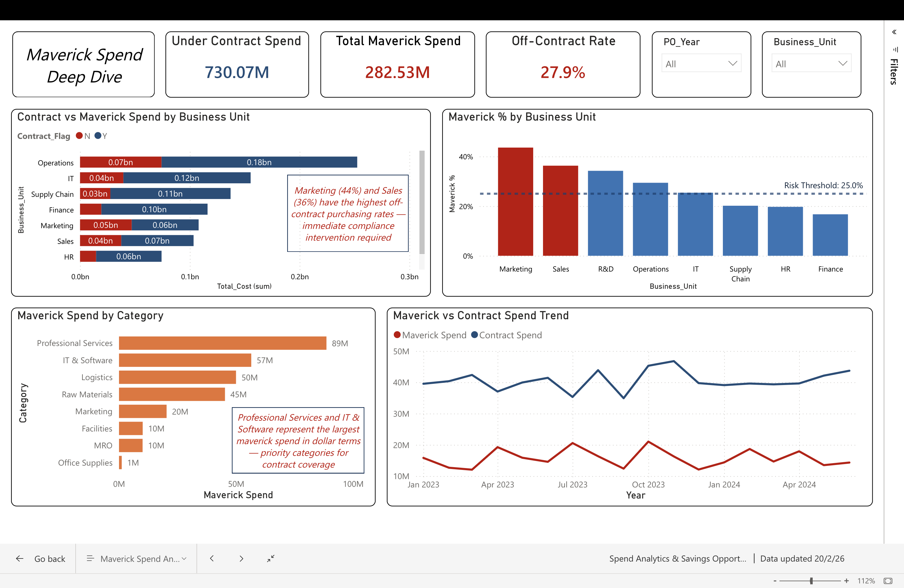
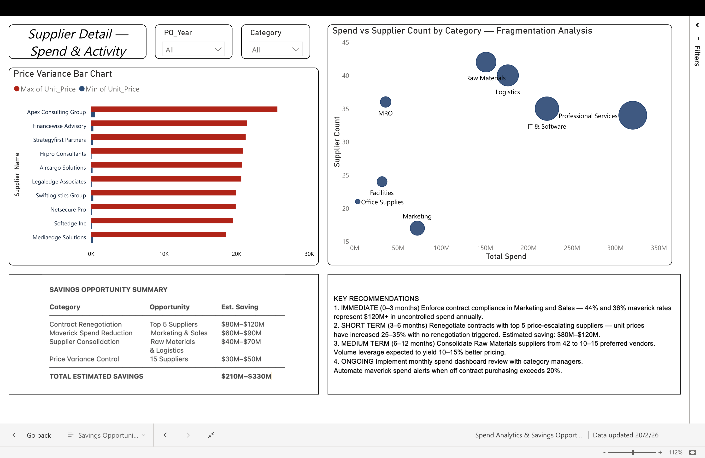

# Procurement Spend Analytics & Savings Opportunity Dashboard

**Author:** Sai Keerthana Malothu  
**Tools:** Python (pandas, matplotlib, seaborn) | PostgreSQL | Power BI | Excel  
**Domain:** Procurement & Supply Chain Analytics  
**Dataset:** Synthetic dataset designed to simulate a real-world mid-size manufacturing procurement environment

---

## Project Overview

This end-to-end analytics project analyzes 18 months of procurement transaction data comprising **10,000 purchase orders across 42 suppliers, 8 spend categories, and 8 business units**. The goal was to build a centralized spend visibility solution that identifies cost-saving opportunities and provides executive-level insights into procurement patterns, supplier performance, and contract compliance.

---

## Business Problem

The procurement team had no centralized visibility into spend patterns, supplier performance, or contract compliance. This made it impossible to:
- Identify where money was being spent across categories and suppliers
- Quantify how much spend was happening outside approved contracts (maverick spend)
- Target suppliers for renegotiation based on price escalation data
- Make data-driven decisions on supplier consolidation

---

## Project Workflow

```
Raw Data → Python Cleaning → PostgreSQL Analysis → Power BI Dashboard → Recommendations
```

### Phase 1 — Data Cleaning & Preparation (Python / Jupyter Notebook)
- Loaded and inspected 10,000 rows of procurement transaction data
- Standardized text fields, fixed date columns, removed duplicates
- Engineered calculated columns: Payment_Cycle_Days, Is_Maverick, Year_Month
- Validated Total_Cost calculations against Quantity × Unit_Price
- Exported cleaned data for SQL and dashboard use

### Phase 2 — SQL Analysis (PostgreSQL)
Six business queries written to answer specific analytical questions:

| Query | Business Question |
|---|---|
| Q1 — Spend by Category | Where is the company spending its money? |
| Q2 — Top 20 Suppliers | Which suppliers represent the highest spend concentration? |
| Q3 — Maverick Spend by BU | Which departments have the highest off-contract purchasing? |
| Q4 — Monthly Trend | How has spend trended over 18 months? |
| Q5 — Consolidation Opportunity | Which categories have too many suppliers? |
| Q6 — Price Variance | Which suppliers have increased prices without renegotiation? |

### Phase 3 — Power BI Dashboard (4 Pages)
Interactive dashboard built in Power BI with slicers for Year, Business Unit, and Category.

### Phase 4 — Findings & Recommendations
Data-driven recommendations with estimated savings impact presented as an executive summary.

---

## Key Findings

| Finding | Detail |
|---|---|
| Total Spend | $1.01 billion across 18 months |
| Maverick Spend | **$282.5M (27.9%)** of total spend is off-contract |
| Highest Maverick Rate | Marketing (44%) and Sales (36%) |
| Spend Concentration | Top 3 suppliers account for 35%+ of total spend |
| Price Escalation | 15 suppliers with 25%+ unit price increases — no renegotiation triggered |
| Fragmentation | Raw Materials and Logistics have 40+ suppliers each |

---

## Estimated Savings Opportunities

| Opportunity | Target | Estimated Saving |
|---|---|---|
| Contract Renegotiation | Top 5 Suppliers | $80M – $120M |
| Maverick Spend Reduction | Marketing & Sales | $60M – $90M |
| Supplier Consolidation | Raw Materials & Logistics | $40M – $70M |
| Price Variance Control | 15 High-Variance Suppliers | $30M – $50M |
| **TOTAL** | | **$210M – $330M** |

---

## Dashboard Preview

### Page 1 — Executive Overview


### Page 2 — Supplier Analysis


### Page 3 — Maverick Spend Analysis


### Page 4 — Savings Opportunities


---

## Repository Structure

```
procurement-spend-analytics/
├── README.md
├── 01_data_cleaning.ipynb                ← Python cleaning & EDA
├── 02_sql_analysis.ipynb                 ← SQL queries & visualizations
├── Spend Analytics & Savings Opportunity Dashboard.pbix  ← Power BI file
├── procurement_spend_data.csv            ← Raw dataset
├── procurement_cleaned.csv               ← Cleaned dataset
├── page1_executive_overview.png          ← Dashboard screenshots
├── page2_supplier_analysis.png
├── page3_maverick_analysis.png
├── page4_savings_opportunities.png
├── chart1_spend_by_category.png          ← Python EDA charts
├── chart2_monthly_trend.png
├── chart3_maverick_by_bu.png
├── chart4_top_suppliers.png
├── chart5_contract_split.png
├── sql_q1_spend_by_category.png          ← SQL output charts
├── sql_q3_maverick_by_bu.png
├── sql_q4_monthly_trend.png
└── sql_q6_price_variance.png
```

---

## Skills Demonstrated

| Category | Skills |
|---|---|
| Data Preparation | Data cleaning, feature engineering, data validation, EDA |
| SQL | Aggregations, window functions, CASE statements, CTEs, subqueries |
| Visualisation | Power BI dashboard design, DAX measures, conditional formatting |
| Python | pandas, matplotlib, seaborn, sqlalchemy, Jupyter Notebook |
| Business Analysis | KPI definition, maverick spend analysis, savings quantification |
| Soft Skills | Stakeholder-ready recommendations, executive summary writing |

---

## How to Use This Repository

1. Clone the repository
```bash
git clone https://github.com/saikeerthanamalothu-dot/procurement-spend-analytics.git
```

2. Install Python dependencies
```bash
pip install pandas numpy matplotlib seaborn openpyxl sqlalchemy psycopg2-binary jupyter
```

3. Run notebooks in order — start with `01_data_cleaning.ipynb` then `02_sql_analysis.ipynb`

4. Open `procurement_spend_analytics.pbix` in Power BI Desktop to explore the dashboard

---

## About

This project was built as part of a data analytics portfolio to demonstrate end-to-end analytical capability across data preparation, SQL analysis, business intelligence, and stakeholder communication. The dataset is synthetic and designed to reflect realistic procurement patterns based on industry benchmarks.

---

*Sai Keerthana Malothu | MSc Business Analytics*
